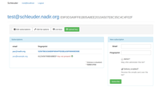

# schleuder-web, a web interface for Schleuder3

This is a full featured web interface to administrate [Schleuder3](https://git.codecoop.org/schleuder/schleuder3)-lists and subscriptions.

##  Installation

### To have a glimpse

1. ./bin/setup
1. ./bin/start
1. Visit http://localhost:3000/

### To run productively

1. Mandatory: edit `config/secrets.yml`.
1. Optional: edit `config/database.yml`.
1. Optional: edit `config/schleuder-web.yml`.
1. `bundle install --without development`.
1. `bundle exec rake db:setup RAILS_ENV=production`.
1. Setup mod_passenger, or a proxy + `bundle exec rails server -e production`.

## Usage

1. Log into the webinterface with email "root@localhost" and password "slingit!".

## Limitations

Only tested with ruby 2.1 so far.

## TODO

* public subscription
* upload key at account-generation.
* only send encrypted account-verification emails?
* Tests, Tests, Tests.
* Prefix fingerprint with 0x to force GnuPG to only match fingerprints.
* superadmin-flag for Accounts.
* Highlight unusable keys in keys- and subscription-overview and -detail.
* Button: send key to all subscribed addresses.
* I18n.

See also `rake notes`

## License

GNU GPL version 3.
