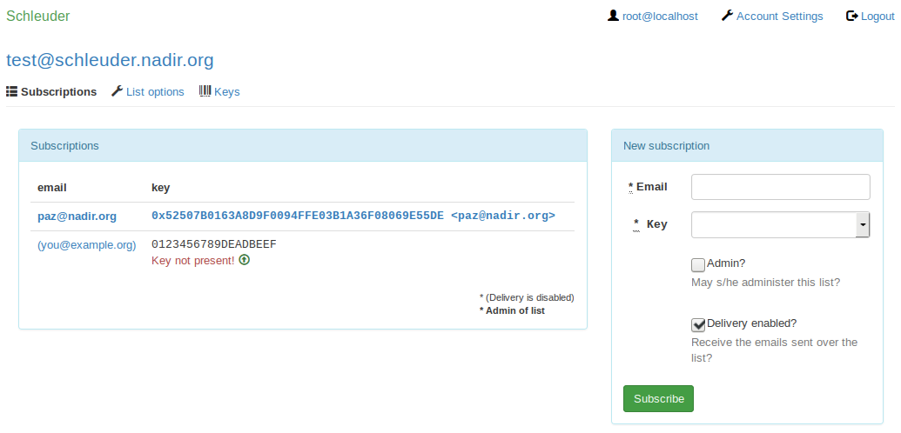

# schleuder-web, a web interface for Schleuder3

This is a full featured web interface to administrate [Schleuder v3](https://0xacab.org/schleuder/schleuder)-lists and subscriptions.

##  Installation

### To have a glimpse

1. ./bin/setup
1. ./bin/start
1. Visit http://localhost:3000/

### To run productively

1. Mandatory: edit `config/secrets.yml`.
1. Optional: edit `config/database.yml`.
1. Optional: edit `config/schleuder-web.yml`.
1. `bundle install --without development`.
1. `bundle exec rake db:setup RAILS_ENV=production`.
1. Setup mod_passenger, or a proxy + `bundle exec rails server -e production`.

## Usage

1. Log into the webinterface with email "root@localhost" and password "slingit!".

## Limitations

Only tested with ruby 2.1 so far.

## TODO

See also `rake notes`

## License

GNU GPL version 3.

## Screenshot

<kbd>

</kbd>

