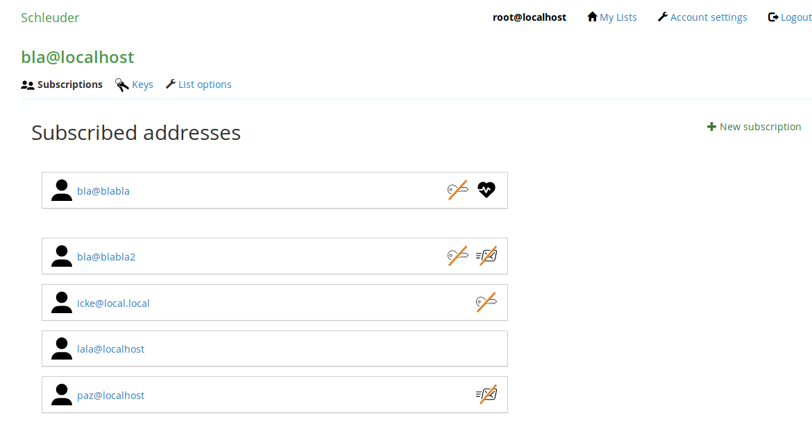

# schleuder-web, a web interface for Schleuder

This is a full featured web interface to administrate [Schleuder](https://0xacab.org/schleuder/schleuder)-lists and subscriptions.

##  Installation

Make sure you have these programs and libraries installed:

* ruby-bundler
* ruby >= 2.7
* libxml2
* zlib
* sqlite3 (or your DMBS of choice)

On a Debian-system, run e.g. this: `apt install ruby ruby-bundler libxml2-dev zlib1g-dev libsqlite3-dev`.


### To have a glimpse

1. bundle install
1. ./bin/setup
1. ./bin/start
1. Visit http://localhost:3000/

### To run productively

1. Mandatory: Set the environment variable `SECRET_KEY_BASE`, so that the rails process can read it (e.g. by exporting it). (If this values changes, all cookies and thus login sessions become invalids, so use a static value if you restart often.)
1. Mandatory: In `config/schleuder-web.yml` add `tls_fingerprint` and `api_key` (get them from the admins that run Schleuder's api-daemon). You can also set them through the environment variables SCHLEUDER_TLS_FINGERPRINT and SCHLEUDER_API_KEY.
1. Optional: edit `config/database.yml`.
1. `bundle install --without development`.
1. `bundle exec rake db:setup RAILS_ENV=production`.
1. Run `RAILS_ENV=production bundle exec rake assets:precompile` to precompile all images and css files.
1. Setup mod_passenger, or a proxy + `bundle exec rails server -e production`.


## Usage

1. Log into the webinterface with email "root@localhost" and password "slingit!".


## Compatibility with Schleuder versions

Schleuder-web adheres to [Semantic Versioning](http://semver.org/), and promises that its major versions shall always be compatible with those of Schleuder. This means that the (imagined) version `1.0.3` of Schleuder-web should work with the (imagined) versions of Schleuder `1.0.5`, `1.1.1`, and `1.2.0`, but not with the (imagined) version `2.0.0`.

Versions are published using signed git-tags.


## TODO

See also `rake notes`

## Testing

We use rspec to test our code. To execute the test suite run:

```
bundle exec rspec
```

We are working on extendig the test coverage.

## Contributing

Please see [CONTRIBUTING.md](CONTRIBUTING.md).

## Mission statement

Please see [MISSION_STATEMENT.md](MISSION_STATEMENT.md).

## Code of Conduct

We adopted a code of conduct. Please read [CODE_OF_CONDUCT.md](CODE_OF_CONDUCT.md).

## License

GNU GPL version 3.

## Screenshot



